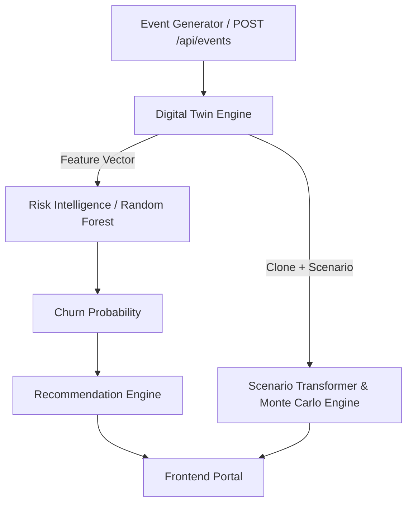

# 👥 Customer Twin — Insurise MVP

A working prototype **Customer Digital Twin** for Insurise: a live, per-customer virtual state that reacts to events, a trained Random Forest churn model that scores it, a Recommendation Engine that turns risk into administrator actions, and a Digital Twin Engine that maintains an auditable transition history, reconstructs past customer states, and clones customer states to simulate hypothetical futures—deterministically or via Monte Carlo—without modifying production data. Monte Carlo is currently available through the manual simulation endpoint; automatic background scoring and cached Monte Carlo results are not yet implemented in this checkout.

> **Prototype Status:** This system uses a synthetic insurance policyholder churn dataset (see `docs/dataset-mapping.md`) 
>
> **Model Inference:** The Random Forest model in `model/` is a fixed, pre-trained artifact. The application performs inference only and does not retrain or modify the model.

---

## 📋 Table of Contents
1. [Concept & Architecture](#concept--architecture)
2. [Component Breakdown](#component-breakdown)
3. [Project Structure](#project-structure)
4. [Setup & Installation](#setup--installation)
5. [Running the Application](#running-the-application)
6. [Demo Scenario](#demo-scenario)
7. [Verification Details](#verification-details)
8. [Reference Documentation & Schema Mappings](#reference-documentation--schema-mappings)
9. [Limitations & Future Production Evolution](#limitations--future-production-evolution)

---

## 📐 Concept & Architecture

At any given moment, a customer is represented by a state `S_t` (containing premium, coverage, claims history, payment behavior, engagement, etc.). Events transform this state:

`S_(t+1) = f(S_t, E_t)`

The Digital Twin Engine maintains this state and synchronizes it with incoming events. It can also clone the state to explore hypothetical scenarios (`S'_t = T(S_t, theta)`) without mutating the persistent state.

Every real transition is also recorded in `storage/event_log.json` with the event envelope, before/after state snapshots, processing time, and model version metadata. See `twin_engine/synchronization/synchronizer.py` and `twin_engine/state/time_travel.py` for the audit and reconstruction paths.

Refer to `docs/architecture.md` for the full component diagram and module map. The high-level data flow is structured as follows:



---

## 🧩 Component Breakdown

### Digital Twin Engine
*Detailed specifications are available in `docs/twin-engine.md`.*
* **Twin State Store** (`twin_engine/state/`): Local JSON-persisted repository acting as the single source of truth for all current digital states.
* **Event Transition Handler** (`twin_engine/events/transition_handler.py`): Implements transition logic `S_(t+1) = f(S_t, E_t)` for the 7 dataset-grounded event types.
* **State Synchronizer** (`twin_engine/synchronization/`): Coordinates sequential event application, persistence, and risk recalculation.
  Each `S_t -> S_(t+1)` transition is appended to the audit log with `prev_state`, `new_state`, `processing_time_ms`, and `model_version`, not only the triggering event.
* **Scenario Transformer** (`twin_engine/simulation/scenario_transformer.py`): Clones customer states and applies speculative changes for simulations without persisting them.
* **Monte Carlo Engine** (`twin_engine/simulation/monte_carlo.py`): Simulates speculative states under configurable uncertainty envelopes to project churn probability distributions.
  The current implementation runs on manual request; there is no `monte_carlo_store.py`, automatic post-event trigger, or cached-result endpoint in this checkout.
* **Time Travel** (`twin_engine/state/time_travel.py`): Reconstructs a customer's state at or before an ISO 8601 timestamp from enriched transition-log snapshots.

### API Endpoints

The FastAPI app exposes the following v2 observability and simulation routes in addition to the existing customer, event, and generator routes:

* `GET /api/customers/{customer_id}/trace`: returns enriched transition records for one customer.
* `GET /api/customers/{customer_id}/state-at?timestamp=...`: returns the reconstructed state at a requested timestamp.
* `POST /api/customers/{customer_id}/simulate`: runs a deterministic what-if simulation.
* `POST /api/customers/{customer_id}/simulate/monte-carlo`: runs a manual Monte Carlo simulation.
* `GET /api/event-generator/status`, `POST /api/event-generator/start`, and `POST /api/event-generator/stop`: control the background event generator. Its controls are part of the single static portal served from `frontend/`; there is no separate event-generation page route.

### Risk Intelligence
* **Predictor Module** (`risk_intelligence/`): Loads the pre-trained Random Forest model and preprocessing pipeline. Returns a `503 Service Unavailable` if model artifacts are missing, and a `422 Unprocessable Entity` (`FeatureMappingError`) on feature schema drift.
* **Driver Identifier**: Discovers root causes of risk by examining the model's `feature_importances_` in tandem with dataset correlations.

### Recommendation Engine
* **Ranker Module** (`recommendation_engine/`): Ranks administrator mitigation options using expected utility theory:
  `EV(action | S) = P(churn) * effect(action) * Value(S) - Cost(action)`
* Default MVP values for effectiveness, customer valuation, and cost parameters are configured in `config.py`.

---

## 📂 Project Structure

```
customer-twin/
├── twin_engine/
│   ├── state/             # State definitions, storage, and time travel
│   │   └── time_travel.py # Reconstructs state from enriched transition logs
│   ├── events/            # Event models, transition handler, and generator
│   ├── synchronization/   # Coordination of event application and persistence
│   └── simulation/        # Scenario transformer and Monte Carlo engines
├── risk_intelligence/     # Churn ML predictor and driver identification
├── recommendation_engine/ # Expected utility based action ranking logic
├── model/                 # Pre-trained Random Forest and preprocessing artifacts
├── data/                  # Synthetic churn dataset and data dictionary
├── api/                   # FastAPI route definitions and schemas
├── frontend/              # Static HTML/CSS/JS files for the admin portal
├── tests/                 # Automated simulation-isolation tests
│   └── test_scenario_isolation.py
├── docs/                  # Detailed architectural and module documentation
├── bootstrap.py           # Populates initial state store from the raw CSV
├── config.py              # Central application config and business assumptions
├── pyproject.toml         # Build configuration
├── requirements.txt       # Hard-pinned runtime dependencies
└── README.md              # Project overview
```

---

## 💻 Setup & Installation

### Prerequisites
* Python 3.11+
* [uv](https://docs.astral.sh/uv/) (recommended high-speed package manager)

### Installation

1. Clone the repository and navigate to the project directory:
   ```bash
   cd customer-twin
   ```

2. Initialize the virtual environment and activate it:
   ```bash
   uv venv .venv --python 3.11
   # On macOS/Linux:
   source .venv/bin/activate
   # On Windows:
   .venv\Scripts\activate
   ```

3. Install project dependencies:
   ```bash
   uv pip install -r requirements.txt
   ```
   *(Alternatively, run `uv sync` to read configurations from `pyproject.toml`.)*

> [!WARNING]
> **scikit-learn Version Requirement**
> The provided model files (`model/*.joblib`) were pickled with `scikit-learn 1.6.1`. Installing a different version may cause warnings or deserialization failures. Keep `scikit-learn==1.6.1` installed.

---

## ⚡ Running the Application

### 1. Launch the Backend Server
Start the FastAPI server via Uvicorn. On first run, this automatically triggers `bootstrap.py` to seed the first 300 rows of `data/customer_churn.csv` into `storage/twin_states.json`.

```bash
uv run uvicorn api.main:app --reload --port 8000
```

### 2. Access the Application
* **Admin Portal UI:** [http://127.0.0.1:8000/](http://127.0.0.1:8000/)
* **Interactive API Documentation:** [http://127.0.0.1:8000/docs](http://127.0.0.1:8000/docs)

### 3. Start the Event Generator
The background event generator simulates real-time client events (e.g., payments missed, complaints, renewals). It can be triggered in three ways:

* **From the UI:** Click **Start Generator** in the Digital Twin details view.
* **As a Standalone CLI Process:**
  ```bash
  uv run python -m twin_engine.events.event_generator
  ```
* **Via API Call:**
  ```bash
  curl -X POST http://127.0.0.1:8000/api/event-generator/start \
    -H "Content-Type: application/json" \
    -d '{"interval_seconds": 3}'
  ```

---

## 🎮 Demo Scenario

1. **Observe Initial State:** Open [http://127.0.0.1:8000/](http://127.0.0.1:8000/), navigate to **Customers**, select a customer, and open their **Digital Twin** view. Note their current churn probability, risk level, and top drivers.
2. **Apply Live Events:** Click **Start Generator** (or post an event manually via `POST /api/events`, e.g., a `payment_missed` event). Watch the Twin state, event timeline, and risk score update in real time.
3. **Run Speculative Simulations:** Go to **Simulation**, select the customer, choose the `premium_changed` scenario, set a change percentage (e.g., `0.15` for a $+15\%$ increase), and run the **deterministic** simulation. Note the change in risk profile without modifying the real stored state.
4. **Inspect the Audit Trace:** Open `GET /api/customers/{id}/trace` to see the triggering event, before/after snapshots, model version, and processing time for each logged transition.
5. **Reconstruct a Past State:** Choose a timestamp between two logged events and call `GET /api/customers/{id}/state-at?timestamp=...` to inspect the customer's state at that point in the timeline.
6. **Run Monte Carlo Analysis:** On the Simulation view, execute the manual Monte Carlo endpoint to view probability distribution statistics (mean, median, P10, P90, std-dev) and a distribution histogram. The current code does not automatically run or cache this result after each event.
7. **Mitigate Risk:** Review the EV calculation details on the Digital Twin dashboard to identify the best action to take.

---

## ✅ Verification Details

The system was verified end-to-end against the following checks:
* **Model Loading:** Confirmed that the four ML artifacts load cleanly, with input/output dimensions aligned.
* **Inference Execution:** Validated that single-customer churn probability predictions are returned within standard ranges.
* **State Transitions:** Verified state mutations for all 7 event types (e.g., `payment_missed` properly updates flags, and risk score changes dynamically).
* **Speculative Clones:** Confirmed that simulations run on exact clones and do not modify or persist changes to the stored state.
* **Automated Isolation Test:** `tests/test_scenario_isolation.py` verifies that a scenario leaves the real stored Twin byte-for-byte unchanged and returns an independent clone.
* **Monte Carlo Variance:** Confirmed outputs (mean, median, P10, P90, std-dev) follow statistical assumptions over 80+ trials.
* **Ranked Recommendations:** Verified expected value calculations and action rankings.
* **Robust Error Boundaries:** Tested HTTP `422` outputs on schema drift and `503` outputs on missing model files.

---

## 📚 Reference Documentation & Schema Mappings

* **Model Schema:** See `model/README.md` for a breakdown of the 34 features (30 numerical, 4 categorical), allowed categorical values, and excluded identifiers.
* **Twin-to-Model Mapping:** See `docs/dataset-mapping.md` for the mapping of raw dataset features to the twin state schema.
* **Event-to-Twin Mapping:** See `docs/event-model.md` for the exact schema modifications associated with the 7 supported events.
* **Simulation Configuration:** See `docs/simulation.md` for details on deterministic and Monte Carlo parameters.
* **Transition Audit and Time Travel:** See `twin_engine/synchronization/synchronizer.py` and `twin_engine/state/time_travel.py` for enriched event logging and historical state reconstruction.
* **Model Deserialization:** `risk_intelligence/predictor.py` handles runtime loading of the model and preprocessor via `joblib.load`.

---

## 🚧 Limitations & Future Production Evolution

### Known Limitations
* **Synthetic Dataset:** Data distributions reflect synthetic patterns and are not production-grade.
* **No Real-Time Broker (Kafka):** Events are processed synchronously in-memory rather than via a distributed stream.
* **Local Persistence:** The application uses flat JSON file storage (`storage/twin_states.json`) and is not thread-safe for high concurrent write volumes. The enriched transition log stores full before/after snapshots, so `storage/event_log.json` grows with every event.
* **Linear Time-Travel Lookup:** Historical reconstruction scans the transition log linearly for each request; it is not indexed.
* **Manual Monte Carlo Only:** Monte Carlo remains an on-demand endpoint. Automatic post-event execution, per-customer result caching, `monte_carlo_store.py`, and a cached-result endpoint are not present yet.
* **Mock Interventions:** Action effects, costs, and value metrics are placeholders.
* **Authentication:** No authentication layer is present (suitable for local MVP demonstration only).

### Production Scaling Seams
The MVP has been designed with clear seams to facilitate production scaling:
* **State Persistence:** Swapping `twin_engine/state/state_store.py`'s backing store for PostgreSQL or Redis can be done without modifying its public interface.
* **Event Streaming:** Ingesting events from a real Kafka broker only requires writing a Kafka consumer that constructs standard `Event` objects and calls `StateSynchronizer.process_event`.
* **Uplift Modeling:** Fixed parameters in `recommendation_engine/effect_estimator.py` can be replaced with learned treatment effects.
